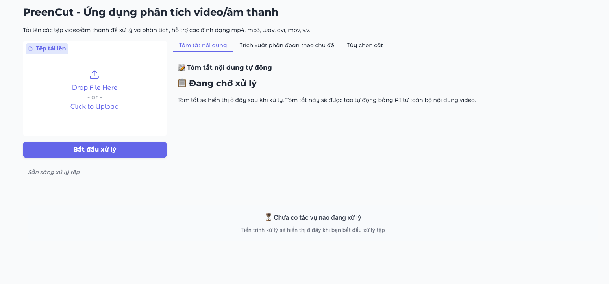
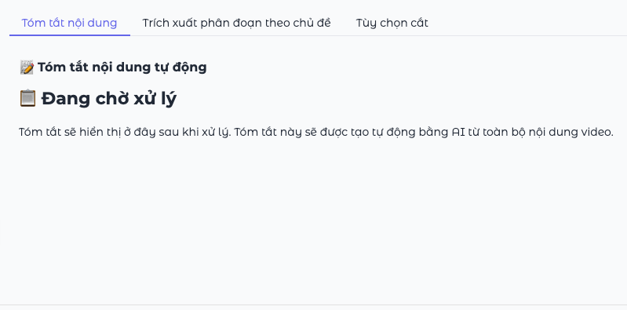
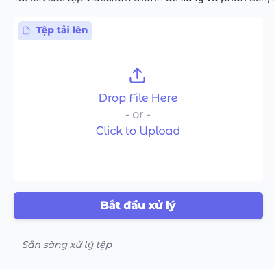
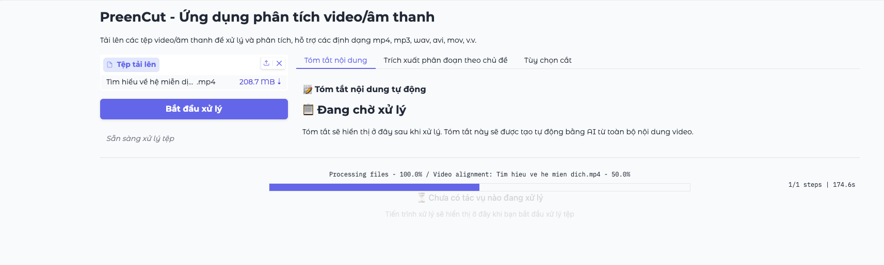
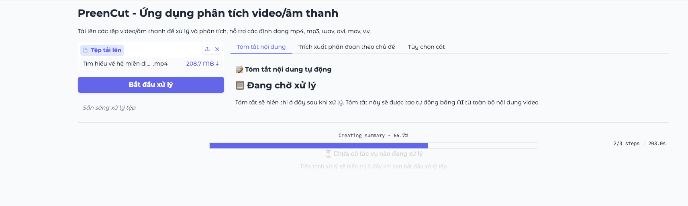
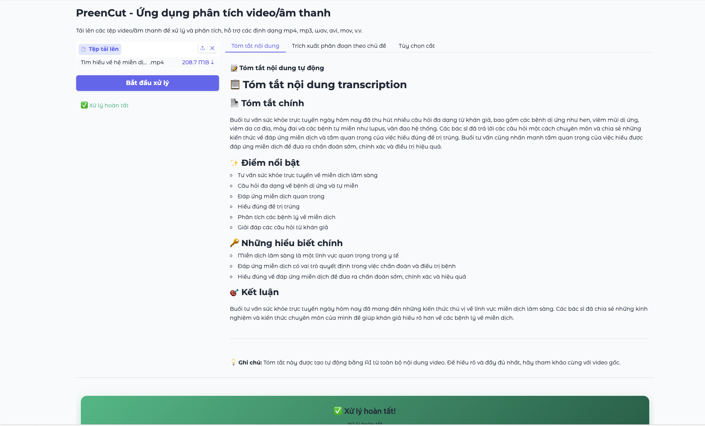
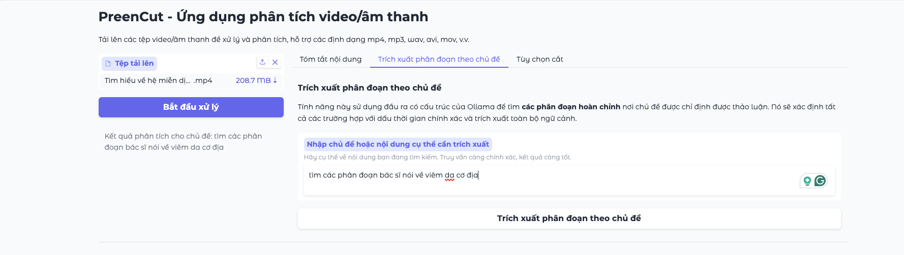
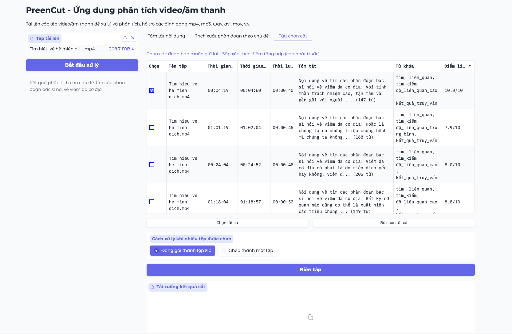
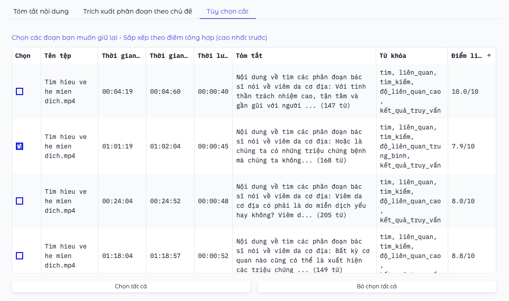

# 📖 Hướng dẫn sử dụng PreenCut

## Mục lục
1. [Giới thiệu](#giới-thiệu)
2. [Bắt đầu sử dụng](#bắt-đầu-sử-dụng)
3. [Giao diện người dùng](#giao-diện-người-dùng)
4. [Xử lý video/âm thanh](#xử-lý-videoâm-thanh)
5. [Tóm tắt nội dung](#tóm-tắt-nội-dung)
6. [Trích xuất phân đoạn theo chủ đề](#trích-xuất-phân-đoạn-theo-chủ-đề)
7. [Tùy chọn cắt và tải xuống](#tùy-chọn-cắt-và-tải-xuống)
8. [Mẹo sử dụng hiệu quả](#mẹo-sử-dụng-hiệu-quả)
9. [Xử lý sự cố](#xử-lý-sự-cố)
10. [Câu hỏi thường gặp](#câu-hỏi-thường-gặp)

---

## Giới thiệu

**PreenCut** là một ứng dụng phân tích video/âm thanh được hỗ trợ bởi trí tuệ nhân tạo (AI), giúp bạn:

- 🎯 **Phân tích nội dung tự động**: AI sẽ nhận dạng giọng nói và phân tích nội dung video
- 📝 **Tạo tóm tắt thông minh**: Tự động tạo tóm tắt từ nội dung video/âm thanh
- 🔍 **Trích xuất phân đoạn theo chủ đề**: Tìm kiếm và trích xuất các phân đoạn cụ thể
- ✂️ **Cắt video chính xác**: Xuất ra các clip video với thời gian chính xác
- 📊 **Đánh giá mức độ liên quan**: Hệ thống chấm điểm thông minh 1-10

### Định dạng file được hỗ trợ

**Video**: MP4, AVI, MOV, MKV, TS, MXF  
**Âm thanh**: MP3, WAV, M4A, FLAC

---

## Bắt đầu sử dụng

### Yêu cầu hệ thống
- Trình duyệt web hiện đại (Chrome, Firefox, Safari, Edge)
- Kết nối internet ổn định
- Không cần cài đặt phần mềm bổ sung
- Máy tính có ít nhất 4GB RAM (8GB khuyến nghị)
- Tối ưu hóa cho máy tính để bàn hoặc laptop (hiện tại chưa tối ưu giao diện cho di động)

### Truy cập ứng dụng
1. Mở trình duyệt web
2. Truy cập địa chỉ PreenCut (http://42.96.34.171:8860/web/)
3. Đợi giao diện tải hoàn tất
4. **Lưu ý không tắt tab trình duyệt khi đang xử lý, nếu có bị lag hay hiện tượng treo web xin hãy đợi 5-10s**

---

## Giao diện người dùng

### Tổng quan giao diện

Giao diện PreenCut được chia thành 2 phần chính:

#### 📤 Khu vực tải lên và điều khiển (Bên trái)
- **Tệp tải lên**: Nơi bạn chọn và tải video/âm thanh
- **Nút "Bắt đầu xử lý"**: Khởi động quá trình phân tích
- **Trạng thái**: Hiển thị tiến trình xử lý realtime

#### 📊 Khu vực kết quả (Bên phải)
Gồm 3 tab chính:
1. **Tóm tắt nội dung**: Hiển thị tóm tắt AI tự động
2. **Trích xuất phân đoạn theo chủ đề**: Tìm kiếm nội dung cụ thể
3. **Tùy chọn cắt**: Chọn và tải xuống các clip

### Thanh trạng thái

Thanh "**Trạng thái**" ở góc trái hiển thị:
- ✅ Tiến trình xử lý (0-100%)
- 📝 Mô tả hoạt động hiện tại
- ⚠️ Thông báo lỗi (nếu có)

**Ví dụ trạng thái**:
- "Khởi tạo các mô hình..." (5%)
- "Đang xử lý tệp 1/2: video.mp4" (30%)
- "Nhận dạng giọng nói: video.mp4" (50%)
- "Phân tích và tóm tắt: video.mp4" (80%)
- "Hoàn tất xử lý!" (100%)

---

## Xử lý video/âm thanh

### Bước 1: Tải lên tệp

1. **Nhấp vào khu vực "Tệp tải lên"** hoặc kéo thả file
2. **Chọn một hoặc nhiều tệp** từ máy tính
3. **Xác nhận tệp đã được chọn** - tên file sẽ hiển thị

**Lưu ý quan trọng**:
- ✅ Tối đa 10 tệp cùng lúc
- ✅ Mỗi tệp tối đa 500MB  
- ✅ Hỗ trợ xử lý hàng loạt

### Bước 2: Bắt đầu xử lý

1. **Nhấp nút "Bắt đầu xử lý"** (màu xanh)
2. **Theo dõi tiến trình** qua thanh "Trạng thái"
3. **Đợi hoàn tất** - quá trình có thể mất vài phút tùy độ dài file

### Quá trình xử lý gồm 4 giai đoạn:

1. **🔧 Khởi tạo mô hình** (5-10%): Tải các mô hình AI
2. **🎵 Trích xuất âm thanh** (10-20%): Chuyển video thành âm thanh
3. **🎤 Nhận dạng giọng nói** (20-60%): Chuyển đổi âm thanh thành văn bản
4. **🧠 Phân tích AI** (60-95%): Phân đoạn và tóm tắt nội dung
5. **📊 Hoàn thiện** (95-100%): Chuẩn bị kết quả hiển thị

*Nhận dạng giọng nói*

*Phân tích video*

*Phân tích và tóm tắt nội dung*

---

## Tóm tắt nội dung

Sau khi xử lý hoàn tất, tab **"Tóm tắt nội dung"** sẽ hiển thị bản tóm tắt AI tự động.

### Cấu trúc tóm tắt

#### 📄 Tóm tắt chính
Đoạn tóm tắt tổng quan về toàn bộ nội dung

#### ✨ Điểm nổi bật  
- Các điểm quan trọng nhất
- Thông tin đáng chú ý
- Nội dung hay nhất

#### 🔑 Những hiểu biết chính
- Kiến thức quan trọng
- Thông tin hữu ích
- Kết luận chính

#### 🎯 Kết luận
Tóm tắt cuối cùng và đánh giá tổng thể

### Lưu ý về tóm tắt
- ✅ **Tự động tạo**: Không cần thao tác thêm
- ✅ **Hỗ trợ tiếng Việt**: Hoàn toàn bằng tiếng Việt
- ✅ **Thích ứng giao diện**: Tương thích với mọi theme
- ⚠️ **Chỉ tham khảo**: Nên kết hợp với video gốc để hiểu đầy đủ

---

## Trích xuất phân đoạn theo chủ đề

Tính năng mạnh mẽ giúp tìm kiếm các phân đoạn cụ thể trong nội dung.

### Cách sử dụng

1. **Chuyển sang tab "Trích xuất phân đoạn theo chủ đề"**
2. **Nhập chủ đề cần tìm** vào ô văn bản
3. **Nhấp "Trích xuất phân đoạn theo chủ đề"**
4. **Xem kết quả** trong bảng dưới

*Ví dụ nhập truy vấn tìm kiếm...*

*...và kết quả phân đoạn tìm thấy*
### Ví dụ truy vấn hiệu quả

#### ✅ Truy vấn tốt:
- "Tìm các phân đoạn thảo luận về triệu chứng cúm ở trẻ nhỏ"
- "Các phần nói về cách nấu món phở truyền thống"
- "Thông tin về đầu tư chứng khoán cho người mới bắt đầu"

#### ❌ Truy vấn kém:
- "Hay" (quá chung chung)
- "Video" (không cụ thể)
- "Nói" (quá rộng)

### Mẹo viết truy vấn hiệu quả

1. **Cụ thể và chi tiết**: Mô tả chính xác nội dung cần tìm
2. **Sử dụng từ khóa**: Bao gồm các từ khóa quan trọng
3. **Ngữ cảnh rõ ràng**: Cung cấp đủ thông tin ngữ cảnh
4. **Độ dài vừa phải**: 10-50 từ là lý tưởng

**[Placeholder: Screenshot ví dụ nhập truy vấn và kết quả]**

---

## Tùy chọn cắt và tải xuống

Tab này hiển thị tất cả các phân đoạn được phân tích, cho phép bạn chọn và tải xuống.

### Bảng phân đoạn

Mỗi hàng trong bảng chứa:

| Cột | Mô tả |
|-----|-------|
| **☑️ Chọn** | Checkbox để chọn phân đoạn |
| **📁 Tên tệp** | Tên file gốc |
| **⏰ Thời gian bắt đầu** | Thời điểm bắt đầu (HH:MM:SS) |
| **⏰ Thời gian kết thúc** | Thời điểm kết thúc (HH:MM:SS) |
| **⏱️ Thời lượng** | Độ dài phân đoạn |
| **📝 Tóm tắt** | Mô tả nội dung phân đoạn |
| **🏷️ Từ khóa** | Tags liên quan |
| **⭐ Điểm liên quan** | Điểm số 1-10 |

### Chọn phân đoạn

#### Cách chọn từng phân đoạn:
1. **Nhấp vào checkbox** ở đầu hàng
2. **Hoặc nhấp vào bất kỳ đâu** trong hàng để toggle
3. **Checkbox tích ✓** = đã chọn
4. **Checkbox trống** = chưa chọn

#### Chọn nhanh:
- **"Chọn tất cả"**: Chọn toàn bộ phân đoạn
- **"Bỏ chọn tất cả"**: Bỏ chọn toàn bộ

### Điểm liên quan (1-10)

Hệ thống chấm điểm thông minh:
- **9-10**: Cực kỳ quan trọng, nội dung xuất sắc
- **7-8**: Rất tốt, nên giữ lại  
- **5-6**: Trung bình, tùy mục đích sử dụng
- **3-4**: Kém quan trọng
- **1-2**: Ít giá trị

💡 **Gợi ý**: Ưu tiên chọn các phân đoạn có điểm ≥ 7

### Cách xử lý khi tải xuống

Chọn một trong hai tùy chọn:

#### 📦 "Đóng gói thành tệp zip"
- Mỗi phân đoạn = 1 file riêng
- Tất cả được đóng gói trong file .zip
- **Thích hợp**: Khi cần chỉnh sửa từng clip riêng

#### 🔗 "Ghép thành một tệp"  
- Tất cả phân đoạn được nối liền
- Tạo ra 1 file video duy nhất
- **Thích hợp**: Khi muốn video liên tục

### Tải xuống

1. **Chọn các phân đoạn** mong muốn
2. **Chọn cách xử lý** (zip hoặc ghép)
3. **Nhấp nút "Biên tập"** (màu xanh)
4. **Đợi xử lý** - thanh "Trạng thái" sẽ cập nhật
5. **Tải xuống** khi xuất hiện link download

---

## Mẹo sử dụng hiệu quả

### 🎯 Để có kết quả tốt nhất

#### Chất lượng file đầu vào:
- ✅ **Âm thanh rõ ràng**: Giọng nói không bị nhiễu
- ✅ **Tốc độ nói vừa phải**: Không quá nhanh hoặc quá chậm  
- ✅ **Âm lượng ổn định**: Không quá nhỏ hoặc quá to
- ✅ **Ít tiếng ồn nền**: Tránh nhạc nền to, tiếng ồn

#### Tối ưu quy trình:
- 📝 **Chuẩn bị truy vấn trước**: Suy nghĩ những gì cần tìm
- 🔄 **Thử nhiều cách mô tả**: Nếu không tìm được, thay đổi từ khóa
- ⏰ **Kiên nhẫn**: Quá trình AI mất thời gian nhưng chính xác
- 💾 **Lưu kết quả**: Backup các file quan trọng

### 📊 Sử dụng điểm số thông minh

- **≥ 8 điểm**: Nội dung viral potential, ưu tiên cao
- **6-7 điểm**: Nội dung tốt, phù hợp đối tượng cụ thể  
- **4-5 điểm**: Nội dung bổ sung, có thể dùng làm context
- **≤ 3 điểm**: Cân nhắc bỏ qua

### 🔍 Tối ưu truy vấn tìm kiếm

#### Chiến thuật mô tả:
1. **Bắt đầu chung → cụ thể**: "Nấu ăn" → "Cách nấu phở bò truyền thống"
2. **Thêm ngữ cảnh**: "Đầu tư" → "Đầu tư chứng khoán cho người mới"
3. **Sử dụng từ đồng nghĩa**: "Làm đẹp" → "Chăm sóc da", "Skincare"

---

## Xử lý sự cố

### ⚠️ Các lỗi thường gặp

#### 🔴 "Tệp không được hỗ trợ"
**Nguyên nhân**: Định dạng file không đúng  
**Giải pháp**: 
- Kiểm tra định dạng: MP4, AVI, MOV, MP3, WAV...
- Chuyển đổi file sang định dạng được hỗ trợ

#### 🔴 "Tệp quá lớn"
**Nguyên nhân**: File vượt quá 10GB  
**Giải pháp**:
- Nén file video với chất lượng thấp hơn
- Cắt file thành nhiều phần nhỏ
- Sử dụng công cụ nén video online

#### 🔴 "Xử lý thất bại"
**Nguyên nhân**: Lỗi trong quá trình AI  
**Giải pháp**:
- Thử lại với file khác
- Kiểm tra chất lượng âm thanh
- Liên hệ quản trị viên nếu lỗi lặp lại

#### 🔴 "Không tìm thấy phân đoạn nào"
**Nguyên nhân**: Truy vấn không phù hợp  
**Giải pháp**:
- Thử truy vấn khác
- Mô tả cụ thể hơn
- Kiểm tra xem nội dung có thực sự tồn tại

### 🛠️ Xử lý sự cố kỹ thuật

#### Trang không tải được:
1. **Refresh trang** (F5 hoặc Ctrl/CMD + R)
2. **Xóa cache trình duyệt**
3. **Thử trình duyệt khác**
4. **Kiểm tra kết nối internet**

#### Tải lên chậm:
1. **Kiểm tra tốc độ mạng**
2. **Thử vào giờ ít người dùng**
3. **Sử dụng file nhỏ hơn**

#### Giao diện bị lỗi:
1. **Refresh trang**
2. **Tắt ad-blocker**
3. **Cập nhật trình duyệt**

---

## Câu hỏi thường gặp

### ❓ Về chức năng

**Q: PreenCut có hỗ trợ tiếng Việt không?**  
A: Có, PreenCut hỗ trợ đầy đủ tiếng Việt cho cả nhận dạng giọng nói và phân tích nội dung video.

**Q: Tôi có thể xử lý bao nhiều file cùng lúc?**  
A: Tối đa 10 file, mỗi file tối đa 10GB.

**Q: File của tôi có bị lưu trữ không?**  
A: File được xử lý tạm thời và sẽ được xóa sau khi hoàn tất. Hãy tải xuống kết quả ngay. (Cập nhật sau sẽ thêm tính năng lưu trữ lại các video đã được upload và xử lý)

**Q: Tại sao xử lý mất nhiều thời gian?**  
A: AI cần thời gian để nhận dạng giọng nói và phân tích nội dung video. File càng dài thì càng mất thời gian. (Ví dụ: video dài ~2 giờ có thể mất 10-15 phút để xử lý trong bước đầu tiên - Sau này sẽ có thể xử lý song song nhiều file cùng lúc và rút ngắn thời gian xử lý)

### ❓ Về kết quả

**Q: Tại sao tóm tắt không chính xác?**  
A: AI dựa trên nội dung Video. Chất lượng âm thanh, hình ảnh tốt sẽ cho kết quả chính xác hơn.

**Q: Điểm số được tính như thế nào?**  
A: AI đánh giá dựa trên tính thú vị, tầm quan trọng và chất lượng nội dung của phân đoạn.

**Q: Tại sao không tìm được phân đoạn tôi cần?**  
A: Thử mô tả cụ thể hơn hoặc dùng từ khóa khác. Nội dung có thể không tồn tại trong file.

### ❓ Về kỹ thuật

**Q: Trình duyệt nào được hỗ trợ?**  
A: Chrome, Firefox, Safari, Edge phiên bản mới nhất.

**Q: Tôi có cần tài khoản không?**  
A: Tùy thuộc vào cấu hình của quản trị viên. (Hiện tại PreenCut không yêu cầu đăng nhập)

**Q: File tải xuống ở đâu?**  
A: Trong thư mục Downloads mặc định của trình duyệt của người dùng.

---

## 📞 Hỗ trợ và liên hệ

### Khi cần hỗ trợ:

1. **Thử các bước xử lý sự cố** ở trên trước
2. **Chuẩn bị thông tin**:
   - Loại file đang sử dụng
   - Thông báo lỗi cụ thể (Sẽ hiện trong giao diện vài giây)
   - Các bước đã thực hiện (Càng cụ thể sẽ xử lý nhanh hơn)
3. **Liên hệ quản trị viên** với đầy đủ thông tin

### Thông tin phiên bản
- **Giao diện**: Gradio Web UI
- **AI Engine**: Whisper + LLM
- **Ngôn ngữ hỗ trợ**: Tiếng Việt, Tiếng Anh
- **Cập nhật**: 1.0.0 (Ngày phát hành: 01/07/2025)

---

## 🎉 Kết luận

PreenCut là công cụ mạnh mẽ giúp bạn phân tích và trích xuất nội dung từ video/âm thanh một cách thông minh. Với hướng dẫn này, bạn đã có thể:

✅ **Tải lên và xử lý** file video/âm thanh  
✅ **Đọc hiểu tóm tắt** AI tự động  
✅ **Tìm kiếm phân đoạn** theo chủ đề  
✅ **Chọn và tải xuống** clip chất lượng cao 
✅ **Xử lý sự cố** cơ bản  

**Hãy thực hành thường xuyên để thành thạo và tận dụng tối đa sức mạnh của AI!**

---

*📝 Hướng dẫn này được cập nhật thường xuyên. Vui lòng kiểm tra phiên bản mới nhất.*
