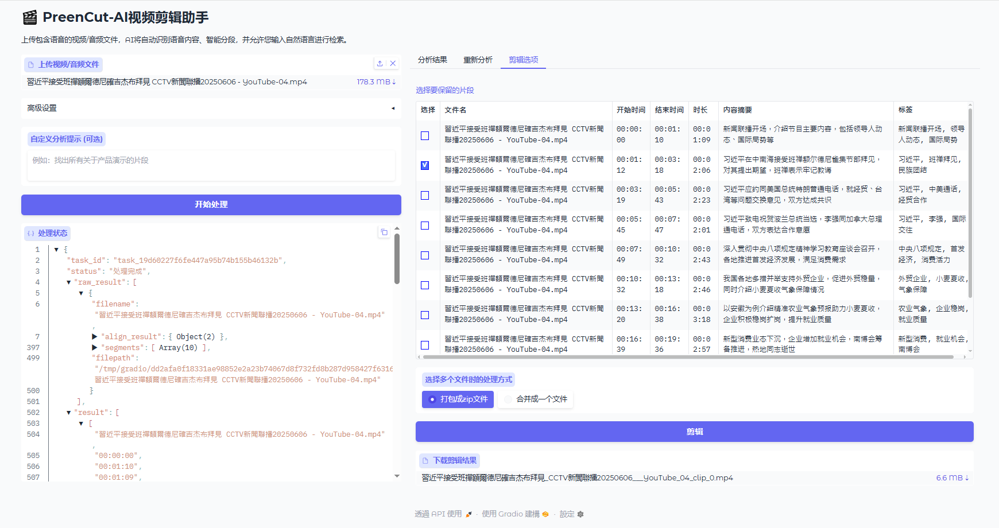

# 🎬 PreenCut - Công cụ cắt video thông minh với AI

[](https://opensource.org/licenses/MIT)
[](https://www.python.org/downloads/)
[](https://gradio.app/)

PreenCut là công cụ biên tập video thông minh tự động phân tích nội dung âm thanh/video bằng công nghệ nhận dạng giọng nói và mô hình ngôn ngữ lớn. Nó giúp bạn nhanh chóng tìm và trích xuất các phân đoạn liên quan từ tệp media bằng truy vấn ngôn ngữ tự nhiên.



## ✨ Tính năng chính

- **🎙️ Nhận dạng giọng nói tự động**: Sử dụng WhisperX cho phiên âm chính xác
- **🧠 Phân tích bằng AI**: Sử dụng mô hình ngôn ngữ lớn để phân đoạn và tóm tắt nội dung
- **💬 Truy vấn bằng ngôn ngữ tự nhiên**: Tìm các đoạn video bằng câu lệnh mô tả như "Tìm tất cả các phân đoạn giới thiệu sản phẩm"
- **✂️ Cắt thông minh**: Chọn và xuất các phân đoạn dưới dạng tệp riêng lẻ hoặc video đã ghép
- **📚 Xử lý hàng loạt**: Tìm một chủ đề cụ thể trong nhiều tệp
- **🔄 Phân tích lại**: Thử nghiệm với các gợi ý khác nhau mà không cần xử lý lại âm thanh
- **🎯 Trích xuất theo chủ đề**: Trích xuất các phân đoạn ngữ cảnh đầy đủ cho các chủ đề cụ thể với dấu thời gian chính xác
- **📱 Tối ưu hóa Social Media**: Tạo clip viral cho TikTok, Instagram Reels, YouTube Shorts
- **📊 Scoring thông minh**: Đánh giá relevancy, engagement và viral potential
- **📥 Download linh hoạt**: Nhiều tùy chọn tải xuống cho từng nền tảng

## 🔍 Tính năng trích xuất theo chủ đề

Tính năng trích xuất theo chủ đề mới tận dụng khả năng đầu ra có cấu trúc của Ollama để xác định và trích xuất các phân đoạn ngữ cảnh đầy đủ xung quanh các chủ đề cụ thể:

- **Ngữ cảnh đầy đủ**: Khác với phân đoạn cơ bản, trích xuất theo chủ đề tìm toàn bộ ngữ cảnh nơi chủ đề được thảo luận
- **Dấu thời gian chính xác**: Đảm bảo thời gian bắt đầu/kết thúc chính xác để nắm bắt toàn bộ câu chuyện
- **Nhiều lần xuất hiện**: Xác định tất cả các trường hợp của một chủ đề trong suốt video, không chỉ lần đề cập đầu tiên
- **Đánh giá mức độ liên quan**: Đánh giá mức độ liên quan của mỗi phân đoạn với truy vấn của bạn
- **Đầu ra có cấu trúc**: Sử dụng chức năng schema JSON của Ollama để có kết quả nhất quán, đáng tin cậy

### Cách sử dụng tính năng trích xuất theo chủ đề:

1. Xử lý (các) tệp video của bạn bằng nút "Bắt đầu xử lý"
2. Chuyển đến tab "Trích xuất phân đoạn theo chủ đề"
3. Nhập chủ đề hoặc gợi ý cụ thể (ví dụ: "Tìm tất cả các thảo luận về năng lượng tái tạo")
4. Chọn mô hình LLM ưa thích của bạn
5. Nhấp vào "Trích xuất phân đoạn theo chủ đề"
6. Đi đến tab "Tùy chọn cắt" để chọn và xuất các phân đoạn đã xác định

## ⚙️ Cài đặt

1. Sao chép kho lưu trữ:

```bash
git clone https://github.com/roothch/PreenCut.git
cd PreenCut
```

2. Cài đặt các gói phụ thuộc:

```bash
pip install -r requirements.txt
```

3. Cài đặt FFmpeg (cần thiết cho xử lý video):

```bash
# ubuntu/Debian
sudo apt install ffmpeg

# CentOS/RHEL
sudo yum install ffmpeg

# macOS (sử dụng Homebrew)
brew install ffmpeg

# Windows: Tải từ https://ffmpeg.org/
```

4. Thiết lập khóa API (cho dịch vụ LLM):
Đầu tiên bạn cần thiết lập dịch vụ llm trong LLM_MODEL_OPTIONS của `config.py`.
Sau đó thiết lập khóa API của bạn dưới dạng biến môi trường:

```bash
# ví dụ, nếu bạn đang sử dụng DeepSeek và DouBao làm dịch vụ LLM
export DEEPSEEK_V3_API_KEY=your_deepseek_api_key
export DOUBAO_1_5_PRO_API_KEY=your_doubao_api_key
```

5. Thiết lập thư mục tệp tạm thời
  thiết lập os.environ['GRADIO_TEMP_DIR'] trong tệp config.py.

## 🚀 Cách sử dụng

1. Khởi động giao diện Gradio:

```bash
python main.py
```

2. Truy cập giao diện web tại http://localhost:8860/web
3. Tải lên tệp video/âm thanh (định dạng hỗ trợ: mp4, avi, mov, mkv, ts, mxf, mp3, wav, flac)
4. Cấu hình tùy chọn:

  - Chọn mô hình LLM
  - Chọn kích thước mô hình Whisper (tiny → large-v3)
  - Thêm gợi ý phân tích tùy chỉnh (Tùy chọn)

5. Nhấp vào "Bắt đầu xử lý" để phân tích nội dung
6. Xem kết quả trong bảng phân tích:

  - Dấu thời gian bắt đầu/kết thúc
  - Thời lượng
  - Tóm tắt nội dung
  - Thẻ được tạo bởi AI

7. Sử dụng tab "Trích xuất phân đoạn theo chủ đề" để thử nghiệm với các gợi ý khác nhau
8. Sử dụng tab "Tùy chọn cắt" để chọn phân đoạn và chọn chế độ xuất:

  - Đóng gói thành tệp ZIP
  - Ghép thành một tệp video

9. Bạn cũng có thể sử dụng API RESTful với tiền tố đường dẫn /api/xxx

    * Tải lên tệp

      > POST /api/upload
      
      body: formdata

      | key  | value type ||
      |------|------------|-|
      | file | file       |

      phản hồi: json
      ```
        { file_path: f'${GRADIO_TEMP_DIR}/files/2025/05/06/uuid.v1().replace('-', '')${file_extension}' }
      ```

    * Tạo tác vụ

      > POST /api/tasks
      
      body: json

      ```json
      {
        "file_path": "đặt đường dẫn tệp ở đây phản hồi từ api tải lên, bắt đầu bằng ${GRADIO_TEMP_DIR}",   
        "llm_model": "DeepSeek-V3-0324",
        "whisper_model_size": "large-v2",
        "prompt": "提取重要信息，时间控制在10s"
      }
      ```

      phản hồi: 
      ```json
        { "task_id": "" }
      ```
    * Truy vấn kết quả tác vụ
    
      GET /api/tasks/{task_id}
      
      phản hồi:
      ```json
      {
        "status": "completed",
        "files": [
            "${GRADIO_TEMP_DIR}/files/2025/06/23/608ecc80500e11f0b08a02420134443f.wav"
        ],
        "prompt": "提取重要信息，时间控制在10s",
        "model_size": "large-v2",
        "llm_model": "DeepSeek-V3-0324",
        "timestamp": 1750668370.6088192,
        "status_info": "共1个文件，正在处理第1个文件",
        "result": [
            {
                "filename": "608ecc80500e11f0b08a02420134443f.wav",
                "align_result": {
                    "segments": [
                        {
                            "text": "有内地媒体报道,嫦娥6号着陆器上升器组合体已经完成了钻取采样,接着正按计划进行月面的表取采样。",
                            "start": 1.145,
                            "end": 9.329
                        }
                    ],
                    "language": "zh"
                },
                "segments": [
                    {
                        "start": 1.145,
                        "end": 9.329,
                        "summary": "嫦娥6号着陆器上升器组合体已完成钻取采样，正进行月面表取采样。",
                        "tags": [
                            "嫦娥6号",
                            "月球采样",
                            "航天科技"
                        ]
                    }
                ],
                "filepath": "${GRADIO_TEMP_DIR}/files/2025/06/23/608ecc80500e11f0b08a02420134443f.wav"
            }
        ],
        "last_accessed": 1750668836.8038888
      }
      ```

## � Cấu trúc dự án

```
PreenCut/
├── 📚 docs/                    # Tài liệu kỹ thuật
│   ├── README.md
│   ├── SOCIAL_MEDIA_DOWNLOAD.md
│   └── ...
├── 🧪 tests/                   # Test files
│   ├── run_all_tests.py
│   ├── test_enhanced_features.py
│   └── ...
├── 🔧 modules/                 # Core modules
│   ├── llm_processor.py
│   ├── video_processor.py
│   └── ...
├── 🌐 web/                     # Web interface
│   └── gradio_ui.py
├── ⚙️ config.py               # Configuration
├── 🚀 main.py                 # Main application
└── 📋 requirements.txt        # Dependencies
```

## 🧪 Testing

Chạy tất cả tests:
```bash
python tests/run_all_tests.py
```

Chạy test riêng lẻ:
```bash
python tests/test_enhanced_features.py
python tests/test_social_media_download.py
```

## �💻 Phát triển
```bash
python3 -m uvicorn main:app --port 8860 --reload
```

## ⚡ Mẹo cải thiện hiệu suất

  - Sử dụng WhisperX để xử lý nhanh hơn, sử dụng faster-whisper cho các phân đoạn ngắn hơn
  - Điều chỉnh WHISPER_BATCH_SIZE dựa trên VRAM có sẵn
  - Sử dụng kích thước mô hình nhỏ hơn cho hệ thống chỉ có CPU

## 📜 Giấy phép
Dự án này được cấp phép theo Giấy phép MIT. Xem tệp [LICENSE](LICENSE) để biết chi tiết.

## ⭐ Lịch sử Star

[](https://www.star-history.com/#roothch/preencut&Date)

